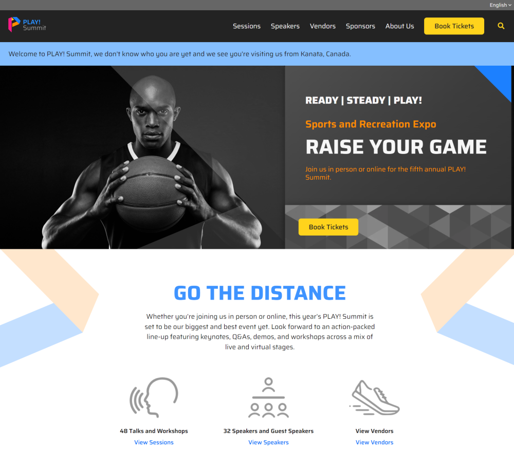

# PLAY! Summit Demo on XM Cloud

A headless site built to showcase the power of Sitecore's composable digital solutions, on XM Cloud

This repository is a Sitecore DXP demo that uses:

- Sitecore XM Cloud
  - XM Cloud Pages Personalize
  - XM Cloud Pages Analyze
- Sitecore Content Hub DAM and CMP
- Sitecore Search
- Sitecore JavaScript Services (JSS)
- Next.js
- Vercel
- Tailwind CSS
- Storybook

## Live Demo

View the live demo at [play-website.sitecoredemo.com](https://play-website.sitecoredemo.com/)

## Storybook

View the [Storybook](https://github.com/storybookjs/storybook) at [play-website-storybook.sitecoredemo.com](https://play-website-storybook.sitecoredemo.com/)

## [📖 Documentation](docs/README.md)

The setup, installation, development, and usage documentation is available in the [docs folder](docs/README.md).

## ⚠ Important notice

### Is PLAY! Summit a starter kit or template solution?

**No.** You should not clone this repository for the purposes of starting a new Sitecore project. There are other community solutions which can be used as a starter for Sitecore implementations. PLAY! Summit is intended as a **demo site demonstrating the full Sitecore DXP capabilities**.

### Is PLAY! Summit supported by Sitecore?

Sitecore maintains the PLAY! Summit example, but PLAY! Summit code is not supported by Sitecore Product Support Services. Please do not submit support tickets regarding PLAY! Summit.

### How can I get help with PLAY! Summit?

For usage questions regarding PLAY! Summit, installation or code, please use [Sitecore Stack Exchange](https://sitecore.stackexchange.com/) or [#sitecoredemo](https://sitecorechat.slack.com/messages/CASEB5M38) on [Sitecore Community Slack](https://sitecore.chat/).

Please do not submit usage questions via GitHub.

### Bug reports

You can use GitHub to submit [bug reports](https://github.com/Sitecore/Sitecore.Demo.XmCloud.PlaySummit/issues/new) for PLAY! Summit.

### Feature requests

You can use GitHub to submit [feature requests](https://github.com/Sitecore/Sitecore.Demo.XmCloud.PlaySummit/issues/new) for PLAY! Summit.

### Contribute

Contributions are always welcome by submitting [pull requests](https://github.com/Sitecore/Sitecore.Demo.XmCloud.PlaySummit/pulls) on GitHub!

### License

Please read the [LICENSE](https://github.com/Sitecore/Sitecore.Demo.XmCloud.PlaySummit/blob/main/LICENSE) carefully prior to using the code in this repository.

### Warranty

The code, samples and/or solutions provided in this repository are for example purposes only and **without warranty (expressed or implied)**. The code has not been extensively tested and is not guaranteed to be bug free.
